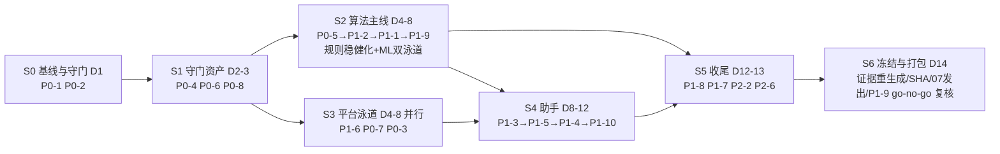

# 05 · 实施路线图（ROADMAP）

> 版本：2026-08-29 ｜ 总工期：**14 天**（1-2 名工程 + 1 名评审；泳道并行）｜ 优化项编号见 `01_GAP_ANALYSIS.md` 附表

---

## §1 阶段依赖图

**关键依赖**：
- P0-4（N01-N07 回归）**必须先于** P1-1 / P1-9 —— 没有误报回归集就无法判断算法改动是改善还是恶化；
- P0-5（提前预警语义）先于 P1-1 —— 先定语义再放宽带；
- P1-3（AnswerProvider）先于 P1-4（NLU）与 P1-5（Q09）—— 后两者复用 provider；
- P1-9（ML）在 S2 内与规则稳健化并行，但**启用决策在 S6 前 go/no-go**；
- P2-2（文档归档）必须在 S6 冻结前完成（SHA 证据依赖 clean commit）。

## §2 阶段明细与门禁（不绿不进下一阶段）

### S0 基线冻结（D1）
| 项 | 内容 |
|---|---|
| P0-1 | `node scripts/h2-sentinel/check-all.mjs`（P0-2 产物先行手写版）全绿并落盘 `validation/baseline/baseline-<sha>.json`（132 仓库测试 + 117 H2 + 75 契约 QA + 169 Python + Ruff + Mypy + 构建 + 9 冒烟 + 验证集 F1/分类/过拟合哨兵） |
| P0-2 | CI 扩展生效（Python + h2:check），PR 验证必红能力 |

**门禁 gate-s0**：基线 JSON 落盘 + CI 红绿行为正确。若基线复现失败 → 说明现状文档虚报，**先修复再迭代**。

### S1 守门资产（D2-3）
| 项 | 内容 |
|---|---|
| P0-4 | `validation/normal-context-regression.mjs` 产出 `normal_context_fp_rate`（N02-N07 分列）并冻结基线 |
| P0-6 | token 归一化 + 多值字段防御 + checker 加固（04§5） |
| P0-8 | 一键演示脚本 + DEMO_SCRIPT.md（04§8） |

**门禁 gate-s1**：三项各有证据产出；checker 对坏样例报错通过；run-demo 双次 <180s。

### S2 算法主线（D4-8，规则与 ML 双泳道）
| 泳道 | 顺序 | 内容 |
|---|---|---|
| 规则 | 1 | P0-5 前瞻判据 + lead_time 指标（02§5） |
| 规则 | 2 | P1-2 可执行性判定（02§6） |
| 规则 | 3 | P1-1 去签名带，**C03→C05→C06 逐类独立 commit**（02§2） |
| ML | 并行 | P1-9：特征工程 → 训练 → 登记 → 接线 → 灰度门禁（02§4；`H2_ML_ENABLED` 默认 false） |

**门禁 gate-s2**：F1 ≥ 0.9718−0.012、FN ≤1、|ΔF1| 哨兵绿、`normal_context_fp_rate` 不升、C05/C07 `lead_time_minutes>0` 可测、其余 5 类 10 分钟内检出率 100%；ML 灰度五条全过才允许默认启用（未过则保持关闭，不阻塞主线）。

### S3 平台泳道（D4-8，与 S2 并行）
| 项 | 内容 |
|---|---|
| P1-6 | 分块/流式导入（04§1）：237MB 全量导入 + 幂等 |
| P0-7 | 影响量化 7/7 四元组（04§6） |
| P0-3 | clean-machine 演练留痕（04§2） |

**门禁 gate-s3**：三项验收各有留痕（导入幂等测试绿 / 四元组文档+对账表 / 换机演练记录）。

### S4 助手（D8-12）
| 顺序 | 项 | 内容 |
|---|---|---|
| 1 | P1-3 | AnswerProvider 注册表，Q01-Q10 参数化（03§2） |
| 2 | P1-5 | Q09 端到端（03§6） |
| 3 | P1-4 | 受限 NLU + 40 条样例集（03§3） |
| 4 | P1-10 | StepFun LLM 层 + 护栏 + 降级链 + 合规声明（03§4） |

**门禁 gate-s4**：Q01-Q10 每题含真实数值/约束引用；追问样例集命中率 ≥90%、越界 100% 拒答；离线模式全链路可完成；LLM 断网自动降级演练通过。

### S5 收尾（D12-13）
| 项 | 内容 |
|---|---|
| P1-8 | 根因数据驱动文本（04§7） |
| P1-7 | 7 类专属图表（04§4） |
| P2-2 / P2-6 | HANDOFF 归档、质量检查扩展（可选，时间不足裁剪） |

**门禁 gate-s5**：根因引用可回溯；7 类图表单测覆盖。

### S6 冻结与打包（D14）
- clean commit 上**一次性重生成全部 ignored 证据**（SHA 只对 clean commit 有效）；
- `07_APPENDIX_ENTERPRISE_QUESTIONS.md` 按最新状态发出企业确认；
- P1-9 go/no-go 复核（灰度五条）；
- submission 包定稿（含 LLM 合规声明，03§4.6）；git tag `gate-s6`。

## §3 裁剪顺序（时间不足时）

**不可裁**：P0 全部八项 + P1-1 + P1-6。
**裁剪顺序**（先裁→后裁）：P1-9 ML 启用（保持关闭回退纯规则）→ P2 全部 → P1-4（追问退回关键词路由）→ P1-8 → P1-10（LLM 层关闭，走降级链不影响验收）。
> P1-9/P1-10 均为"默认可关闭"设计，裁剪不破坏其余系统。

## §4 每日纪律
- 每门禁一个 git tag（`gate-s0` … `gate-s6`）；算法改动独立 commit 附四项指标对照；
- 30 分钟一站会对照本表勾状态（同步到 `00_README.md` §5 看板）；
- 任何口径类疑问 → 记入 `07_APPENDIX_ENTERPRISE_QUESTIONS.md`，不阻塞开发（走保守默认口径）。